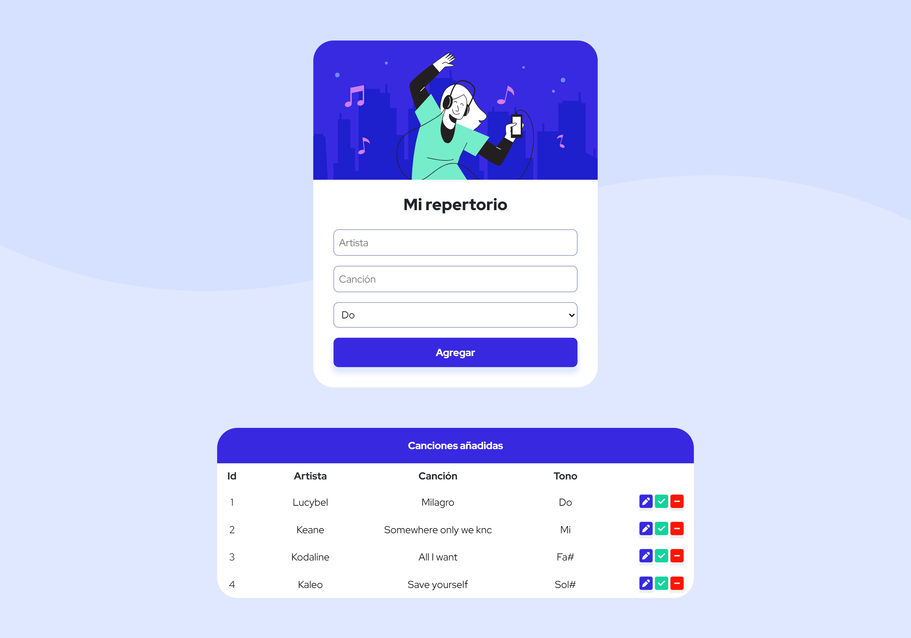

# Desafío - Mi repertorio

En este desafío se validan los conocimientos sobre Levantar un servidor con conexión a PostgreSQL, Insertar registros, Consultar registros, Actualizar registros y Eliminar registros.

## Screenshots

## Rutas Disponibles

- POST /addSong: Inserta una nueva canción en la tabla de canciones.
- GET /getSongs: Obtiene todas las canciones de la tabla y las devuelve en formato JSON.
- PUT /editSongs: Actualiza la información de una canción existente en la tabla.
- DELETE /deleteSongs: Elimina una canción de la base de datos según su ID.

## Dependencias Utilizadas

- express: Framework web para Node.js.
- pg: Cliente PostgreSQL para Node.js.
- cors: Middleware de Express para habilitar el intercambio de recursos entre diferentes orígenes.
- nodemon: Herramienta para reiniciar automáticamente el servidor al detectar cambios en los archivos.

## Instalación y Uso

- Descarga el repositorio.
- Instala las dependencias usando `npm install cors pg express nodemon`.
- Ejecuta el servidor con npm run dev. 